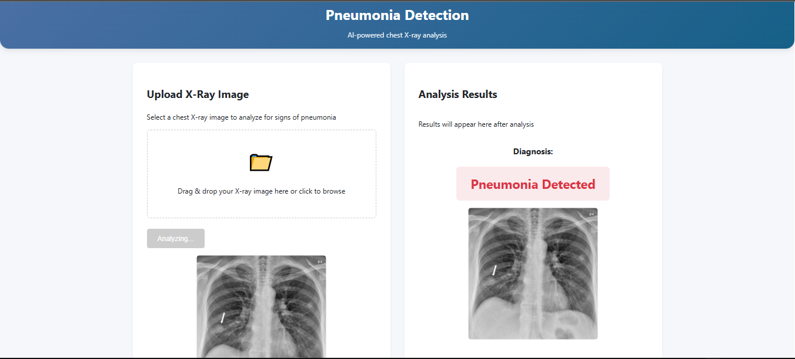

# Pneumonia Detection from Chest X-Rays

An AI-powered web app to detect pneumonia from chest X-ray images using multiple ML models (Random Forest, CNN, MobileNetV2, Autoencoder).

## 📌 Key Features
- **Multi-Model Support**: Compare predictions from 4 models:
  - Random Forest (85.82% accuracy)
  - MobileNetV2 (96.07% val accuracy)
  - CNN (95.31% val accuracy)
  - Autoencoder (92.82% val accuracy)
- **Web Interface**: Flask-based UI for easy uploads and predictions.
- **Data Augmentation**: Enhanced training with image transformations.

## 📊 Model Performance

|  Model | Accuracy |
|----------|----------|
| MobileNetV2 | 96.07% |
| CNN | 95.31% |
| Autoencoder | 92.82% |
| Random Forest | 85.82% |

## 📂 Dataset
Source: Chest X-Ray Images (Pneumonia)

Classes:
- Normal (1,349 images)
- Pneumonia (3,883 images)

## Web Application Interface

